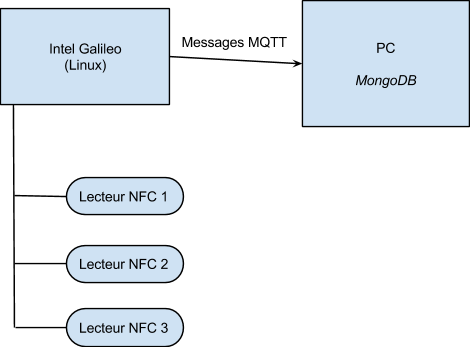

<html><head><title>Copie de CR galileo</title><meta content="text/html; charset=UTF-8" http-equiv="content-type"></head><body class="c15"><h1 class="c12 c2">Dependencies</h1><h1 class="c12 c2">For the galileo you need to use a linux distibution.</h1><ul class="c10 lst-kix_o0jvza34prkq-0 start"><li class="c8 c2"><h1 style="display:inline">Python</h1></li><li class="c8 c2"><h1 style="display:inline">Python-nfcpy</h1></li><li class="c8 c2"><h1 style="display:inline">Mosquitto</h1></li></ul><h1 class="c12 c2">On the server side you will need.</h1><ul class="c10 lst-kix_hg9egen3l8tk-0 start"><li class="c8 c2"><h1 style="display:inline">Python</h1></li><li class="c8 c2"><h1 style="display:inline">Python-nfcpy</h1></li><li class="c8 c2"><h1 style="display:inline">Python-pygame</h1></li><li class="c8 c2"><h1 style="display:inline">Mosquitto</h1></li><li class="c8 c2"><h1 style="display:inline">NodeJS</h1></li><li class="c2 c8"><h1 style="display:inline">MongoDB</h1></li></ul><h1 class="c12 c2">Usage</h1><h1 class="c12 c2">First you must launch the three readers on the galileo, one for each nfc reader with a different vote value.</h1>

<table cellpadding="0" cellspacing="0" class="c11"><tbody><tr class="c5"><td class="c14">
python read.py 002:004 0
</td></tr></tbody></table><h1 class="c12 c2">On the server side you have to run the mongoDB database and the mqtt broker.</h1><table cellpadding="0" cellspacing="0" class="c11"><tbody><tr class="c5"><td class="c14">
sudo ./bin/mongod --rest mosquitto
</td></tr></tbody></table><h1 class="c2 c12"> Then you run the NodeJS server and the display python programm.</h1>

<table cellpadding="0" cellspacing="0" class="c11"><tbody><tr class="c5"><td class="c14">
node serv.js python affichage.py
</td></tr></tbody></table>

<h1 class="c12 c2 c20"> </h1><h1 class="c2">Introduction</h1>
Le capteur que l&rsquo;on nous a confi&eacute; est un lecteur de Tag NFC. Le but de ce projet &eacute;tait de r&eacute;cup&eacute;rer les donn&eacute;es de ce lecteur et de s&rsquo;en servir pour effectuer un vote. L&rsquo;id&eacute;e &eacute;tait de relier trois lecteurs NFC sur un galileo et d&rsquo;affecter &agrave; chacun une valeur pour le vote actuel (Positif, N&eacute;gatif, Neutre). Ce syst&egrave;me de vote permet une grande facilit&eacute; d&rsquo;utilisation puisqu&rsquo;on peut imaginer l&rsquo;utiliser dans une conf&eacute;rence ou chaque invit&eacute; a un badge avec un Tag NFC dont il se servira pour voter simplement en l&rsquo;approchant du lecteur correspondant &agrave; son choix. Ce syst&egrave;me rend le vote tr&egrave;s rapide et permet du surcro&icirc;t de v&eacute;rifier que chaque personne ne vote qu&rsquo;une fois.

Les diff&eacute;rents outils utilis&eacute;s sont Mqtt et MongoDB. Nous les utilisons au travers de scripts NodeJS et Python.

<h1 class="c2">Architecture</h1>
Voici l&rsquo;architecture du projet :

Les trois lecteurs NFC sons connect&eacute;s en USB sur le port USB Host du Galileo. Le Galileo est reli&eacute; directement au PC par un cable RJ 45.

<h2 class="c2">Galileo</h2>
Le Galileo fait tourner un syst&egrave;me Linux pr&eacute;sent sur sa carte SD. Le fait d&rsquo;avoir Linux sur le Galileo nous permet d&rsquo;avoir le support de l&rsquo;USB ainsi qu&rsquo;un interpr&egrave;te python et l&rsquo;ajout des librairies n&eacute;cessaires pour mqtt est &eacute;galement facilit&eacute;. Nous avons compil&eacute; mosquitto (Mqtt) directement sur la carte pour pouvoir lancer un broker Mqtt et se servir des bindings python pour le Mqtt.
<h2 class="c2">PC</h2>
Le PC a lui aussi un broker Mqtt qui tourne et qui lui permet de recevoir les messages envoy&eacute; par le Galileo. On lance &eacute;galement une base de donn&eacute;es MongoDB qui nous sert &agrave; stocker les votes. Pour finir nous utilisons un serveur NodeJS pour recevoir les messages du Galileo et remplir la base de donn&eacute;es.

<h1 class="c2">Logiciel</h1><h2 class="c2">Galileo</h2>
On lance trois scripts python, un pour chaque lecteur NFC branch&eacute; en USB. Chacun g&egrave;re une valeur pour le vote (Positif=0, N&eacute;gatif=1, Neutre=2). Pour lancer ces scripts il faut r&eacute;cup&eacute;rer l&rsquo;identifiant du device USB &agrave; l&rsquo;aide de la commande lsusb :

<table cellpadding="0" cellspacing="0" class="c11"><tbody><tr class="c5"><td class="c14">
root@clanton:~# lsusb

Bus 002&nbsp;Device 003: ID 05e3:0608 Genesys Logic, Inc. USB-2.0 4-Port HUB

Bus 001 Device 001: ID 1d6b:0001 Linux Foundation 1.1 root hub

Bus 002 Device 001: ID 1d6b:0002 Linux Foundation 2.0 root hub

Bus 002&nbsp;Device 005: ID 04e6:5591&nbsp;SCM Microsystems, Inc.

Bus 002 Device 004: ID 04e6:5591 SCM Microsystems, Inc.
</td></tr></tbody></table>

Par exemple si l&rsquo;on s&rsquo;int&eacute;resse au premier lecteur SCM Microsystems, les identifiants qui nous int&eacute;ressent sont 002 et 005.

Admettons qu&rsquo;on affecte &agrave; ce lecteur la valeur 0, voici l&rsquo;appel &agrave; effectuer :

<table cellpadding="0" cellspacing="0" class="c11"><tbody><tr class="c5"><td class="c14">
python read.py 002:005 1
</td></tr></tbody></table>

On fera de m&ecirc;me pour les autres lecteurs.

Le script read.py se sert de la librairie python nfc. On d&eacute;finit un handler pour chaque lecture d&rsquo;un tag NFC. Ce handler lit le contenu du tag NFC et transmet dans un message Mqtt l&rsquo;id du votant et la valeur du vote.

<h2 class="c2">PC</h2>
Du c&ocirc;t&eacute; du PC on a dans un premier temps un serveur NodeJS qui permet d&rsquo;interfacer avec le Galileo, la base de donn&eacute;es MongoDB et le programme python d&rsquo;affichage des votes.

La base de donn&eacute;es MongoDB permet le stockage des votes. Elle nous permet &eacute;galement indirectement de v&eacute;rifier qu&rsquo;une personne ne v&ocirc;te pas deux fois gr&acirc;ce &agrave; l&rsquo;exception duplicate key qui est lev&eacute; si la personne a d&eacute;j&agrave; v&ocirc;t&eacute;.

Pour le serveur NodeJS on a besoin de deux parties principales.

La premi&egrave;re partie est la base de donn&eacute;es mongoDB. On se connecte &agrave; celle-ci pour pouvoir ajouter des entr&eacute;es. Pour ajouter des entr&eacute;es il faut cr&eacute;er un sch&eacute;ma, il est compos&eacute; d&#39;un id unique et de la valeur du vote.

La seconde partie est le support des messages mqtt. A chaque vote, on re&ccedil;oit un message mqtt qui nous en informe. Pour cela on souscrit au topic des votes, avec un client qui &eacute;coute sur l&#39;ip du galileo.

A chaque r&eacute;ception d&#39;un message on tente d&#39;ins&eacute;rer le vote avec l&#39;id du votant. Si cet id est d&eacute;j&agrave; pr&eacute;sent dans la table on ne duplique pas son vote et on affiche un message d&#39;erreur. Si le vote est valide on transmet un second message mqtt sur un autre topic qui servira &agrave; l&#39;affichage.

Le programme d&rsquo;affichage lorsqu&rsquo;il est lanc&eacute; r&eacute;cup&egrave;re les valeurs d&eacute;j&agrave; pr&eacute;sente en base de donn&eacute;es. Par la suite &agrave; chaque r&eacute;ception d&rsquo;un message mqtt constitu&eacute; de la valeur du vote l&rsquo;affichage est actualis&eacute;. L&rsquo;affichage est r&eacute;alis&eacute; &agrave; l&rsquo;aide de la librairie pygame qui permet d&rsquo;afficher des rectangles et du texte. Les coordonn&eacute;es des rectangles sont calcul&eacute;s selon la taille du plus grand des trois, de mani&egrave;re &agrave; ce que l&rsquo;&eacute;chelle soit respect&eacute;e.

</body></html>